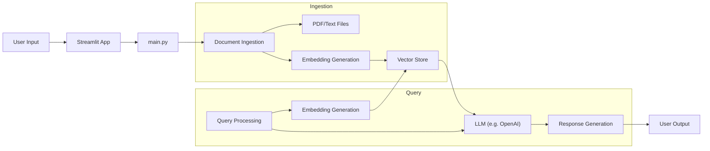
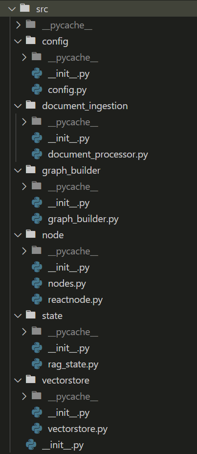

# RAG-Document-Search
A simple yet powerful pipeline for building a Retrieval-Augmented Generation (RAG) powered document search system.

## Architecture Diagram

## 🎯 What this is

This project enables you to:

- Ingest a collection of documents (PDFs, text files, etc.)

- Create embeddings or index them for semantic retrieval

- Serve queries against that document base

- Use a language model to generate responses grounded in the retrieved content

In short: you feed the system your documents, ask a question, it retrieves relevant info + uses a generative model to craft the answer — bridging search and generation.

## 🧠 Why it matters

The RAG (Retrieval-Augmented Generation) paradigm is becoming increasingly important: large language models alone may lack up-to-date or domain-specific knowledge, but by retrieving relevant documents and feeding them into the model, you can ground responses in real facts and minimise “hallucinations”.

This repository gives you a practical implementation of that idea in the context of document search.

## 🚀 Getting started

Here’s how to get things up and running.

### 1. Prerequisites

You’ll need:

- Python 3.10+

- Dependencies as listed in requirements.txt

- A collection of documents you want to index (PDFs, text, etc.)

- (Optionally) credentials or API keys for any embedding / model service you use

### 2. Setup

`git clone https://github.com/anulsasidharan/RAG-Document-Search.git`

`cd RAG-Document-Search`

`pip install -r requirements.txt`

### 3. Index your documents
Place your documents in the data/ directory (or whatever path you configure) and run the ingestion/indexing script:

`python src\document_ingestion\document_processor.py`

(This will create embeddings, build the retrieval index, etc.)

### 4. Start the application

To launch a UI (via Streamlit) for querying:

`streamlit run streamlit_app.py`

Then open http://localhost:8501 in your browser and ask your document base a question.

### 5. Querying

Enter your question, pick the number of retrieved chunks, then submit. The system will:

- retrieve relevant chunks

- send them to the LLM with your question

- return a grounded answer

## 🧩 Project structure

## 📋System Design

## ✅ Features (and optional enhancements)

### Included features:

- Document ingestion / chunking

- Semantic embedding or index creation

- Retrieval of the most relevant document segments
 
- Prompting an LLM with retrieved content + question

### Possible extensions:

- Support for more file formats (Word, Excel, images)

- Improved chunking strategies (e.g., tables, code blocks)

- Re-ranking of results before generation

- Logging, analytics on query performance

- Deployment to cloud or a serverless environment

## 🧪 Example workflow

> You have a folder of 100 technical manuals, want to enable “ask your docs” functionality for your team.

- Drop the manuals into data/.

- Run ingestion to create the embeddings/index.

- Launch the Streamlit UI.

- A user asks: “What are the safety procedures for model X?”

- The system retrieves relevant segments from the manuals, sends them + the question to the LLM, and returns a succinct answer with references to the specific manual/page.

## 📋 Dependencies
See `requirements.txt` for a full list. Key libraries include:

- `langchain` / `llama-index` (or whatever embedding/retrieval stack you’re using)

- An LLM client (`OpenAI`, `Azure`, etc.)

- `streamlit` for the UI

